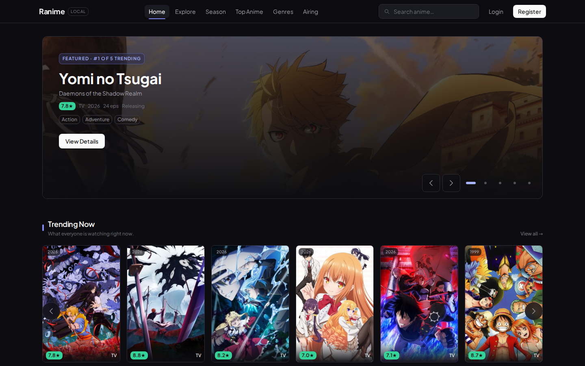
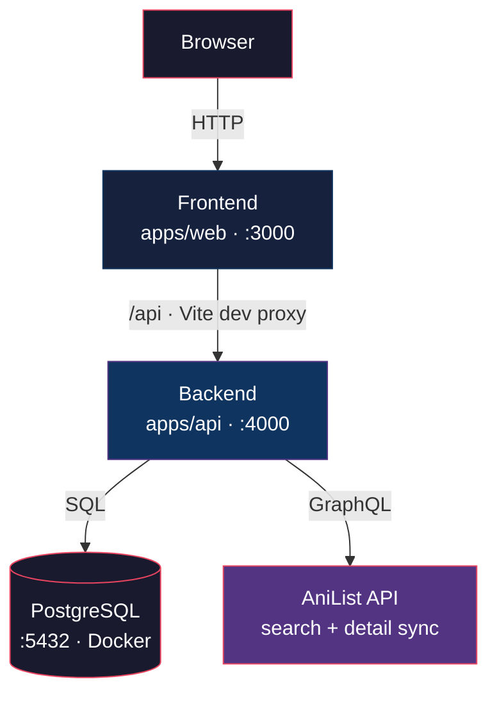

# Ranime

Anime discovery, catalog, tracking, rating and review platform, **local-first**, powered by the
AniList GraphQL API and a local PostgreSQL database.

> Status: All milestones (M1–M11) complete — catalog sync, auth, library tracking, watchlist,
> ratings, reviews with spoiler protection, and statistics are implemented and tested.

Docs: [Cara Menjalankan (panduan lengkap)](RUNBOOK.md) · [Architecture](ARCHITECTURE.md) · [Database](docs/DATABASE.md) · [Troubleshooting](docs/TROUBLESHOOTING.md) · [Contributing](CONTRIBUTING.md) · License: MIT



## Tech Stack

| Layer    | Technology                                                          |
| -------- | ------------------------------------------------------------------- |
| Frontend | React, TypeScript, Vite, React Router, TanStack Query, Tailwind CSS |
| Backend  | Node.js, TypeScript, Fastify, Zod                                   |
| Database | PostgreSQL 16 (Docker)                                              |
| Auth     | JWT in HTTP-only cookie, Argon2id                                    |
| Sync     | AniList GraphQL API (search + on-demand full detail sync)         |
| Testing  | Vitest (API integration + component tests)                          |
| Infra    | Docker Compose (PostgreSQL only)                                    |

## Architecture



Browser never talks to AniList directly — all external data flows through the backend, is
normalized and persisted locally.

## Prerequisites

- WSL2 Ubuntu (or any Linux)
- Node.js >= 22
- Docker + docker-compose

## Quick Start

```bash
npm install

# environment
cp .env.example .env
# then generate a JWT_SECRET:  openssl rand -hex 32

# database
npm run db:up        # docker-compose up -d

# run both apps (api on :4000, web on :3000)
npm run dev
```

Open http://localhost:3000.

## Scripts

| Script              | Description                             |
| ------------------- | --------------------------------------- |
| `npm run dev`       | Run API + web concurrently (watch mode) |
| `npm run build`     | Build API (tsup) + web (vite)           |
| `npm run typecheck` | TypeScript check across all workspaces  |
| `npm run lint`      | ESLint (flat config)                    |
| `npm run format`    | Prettier write                          |
| `npm run test`      | Vitest (API + web)                      |
| `npm run db:up`     | Start PostgreSQL container              |
| `npm run db:down`   | Stop PostgreSQL container               |

## Features

| Area        | Details                                                                |
| ----------- | ---------------------------------------------------------------------- |
| Catalog     | Search + browse with genre/season/status filters, pagination            |
| Detail      | Synopsis, episode count, year, genres, characters, staff, relations, recommendations |
| Sync        | On-demand AniList sync, dedup (same title returns same record)         |
| Library     | Track status (planning/watching/completed/paused/dropped), episode progress |
| Watchlist   | One-click add/remove from catalog, detail, and home hero                |
| Ratings     | 0.5–10 step, community average + your rating side by side               |
| Reviews     | Write/edit/delete with spoiler blur (avatars & bodies hidden)           |
| Statistics  | Totals, averages, watched episodes, ratings/genre/status charts         |
| Auth        | Register/login/logout, Argon2id hashing, JWT in HTTP-only cookie        |

## Project Structure

```
├── apps/
│   ├── api/                  # Fastify backend (:4000)
│   │   └── src/
│   │       ├── config/       # zod-validated env
│   │       ├── database/     # pg pool
│   │       ├── modules/      # feature modules (health, auth, anime, ...)
│   │       ├── services/     # AniList sync, data mutations, stats
│   │       └── types/
│   └── web/                  # Vite React frontend (:3000)
│       └── src/
│           ├── lib/          # API client
│           └── pages/        # routes + components
├── packages/
│   └── shared/               # API contract types ({data}/{error} envelope)
├── database/                 # migrations & seed
├── docker-compose.yml
├── .env.example
└── PRD.md
```

## Environment Variables

See `.env.example`. `DATABASE_URL` and `JWT_SECRET` are required; startup fails fast with a clear
message if they are missing or invalid. Secrets must never be committed (`.env` is gitignored).

## API Contract

All responses follow a consistent envelope (PRD #83):

```json
{ "data": {}, "meta": {} }              // success
{ "error": { "code": "CODE", "message": "..." } }  // error
```

Key endpoint groups (full list in `apps/api/src/routes/`):

| Group        | Examples                                                          |
| ------------ | ----------------------------------------------------------------- |
| Health       | `GET /api/health`                                                 |
| Auth         | `POST /api/auth/register`, `/login`, `/logout`, `GET /auth/me`    |
| Catalog      | `GET /api/genres`, `/api/genres/:slug`, `/api/season`, `/api/top`, `/api/airing` |
| Anime        | `GET /api/anime`, `/api/anime/:id`, `/anime/:id/{characters,staff,relations,recommendations}` |
| Library      | `GET /api/library`                                                |
| Watchlist    | `POST/PUT/DELETE /api/anime/:id/watchlist`, `GET /api/watchlist`, `/watchlist/status-counts` |
| Ratings      | `POST/PUT/DELETE /api/anime/:id/rating`                           |
| Reviews      | `POST/GET /api/anime/:id/reviews`, `GET .../reviews/mine`, `PUT/DELETE /api/reviews/:id` |
| Statistics   | `GET /api/statistics`                                             |
| Users        | `GET /api/users/:username`, `POST /api/users/me/avatar`           |

## Testing

```bash
npm test
```

- `apps/api/test/` — 63 integration tests: auth, anime sync + dedup, library, watchlist, ratings,
  reviews, spoiler protection, statistics (Fastify `inject` + real PostgreSQL)
- `apps/web/src/` — component tests (Vitest + Testing Library)
