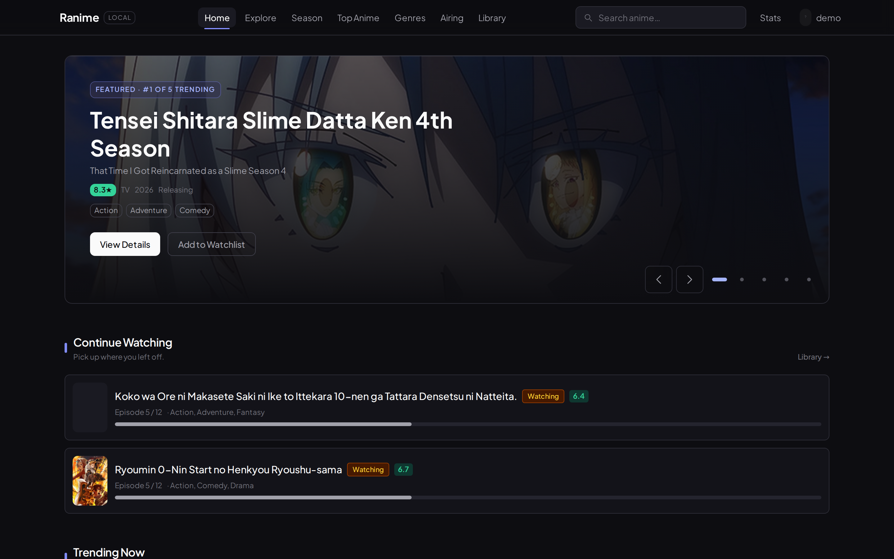
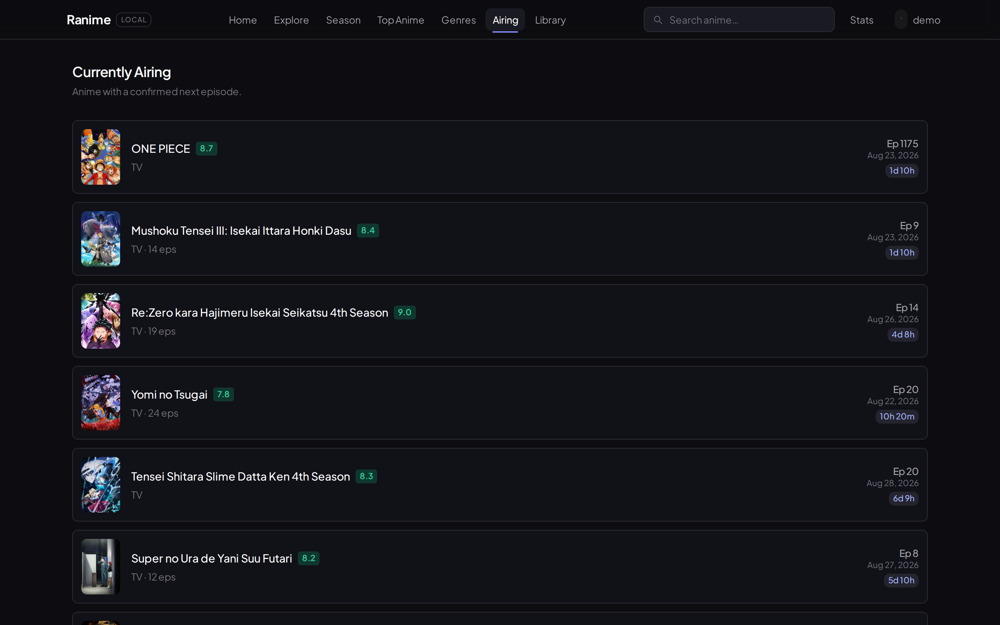
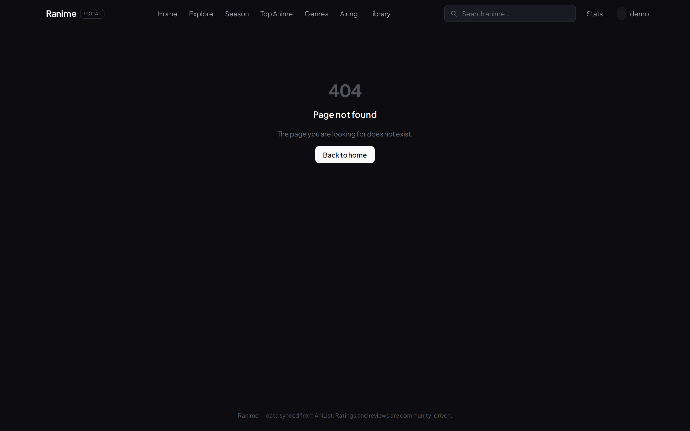
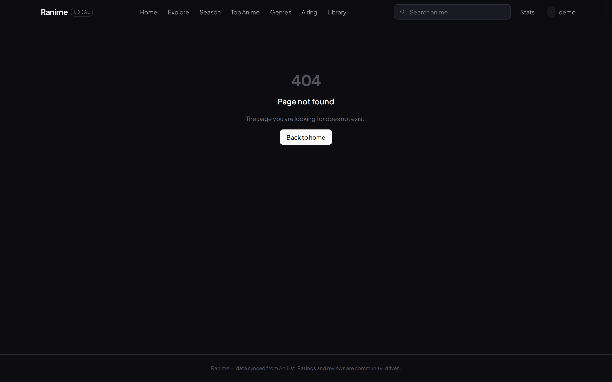
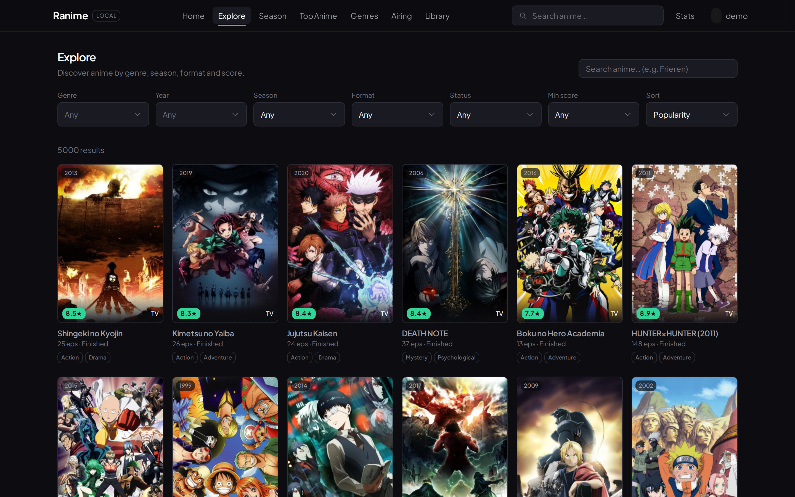
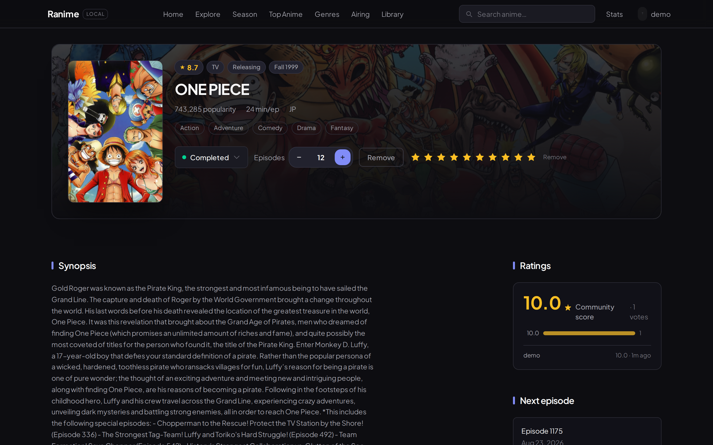
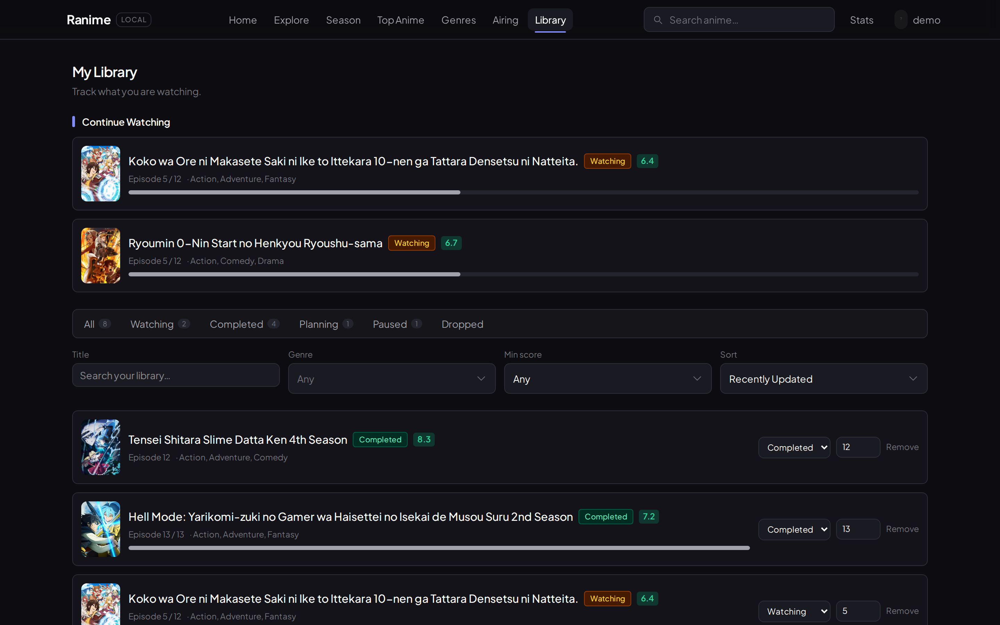
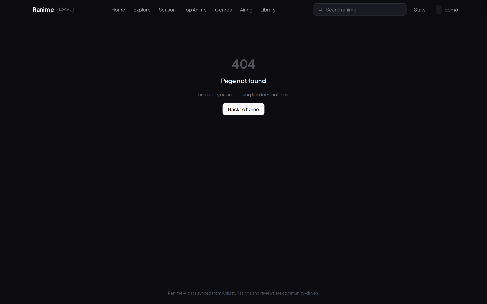
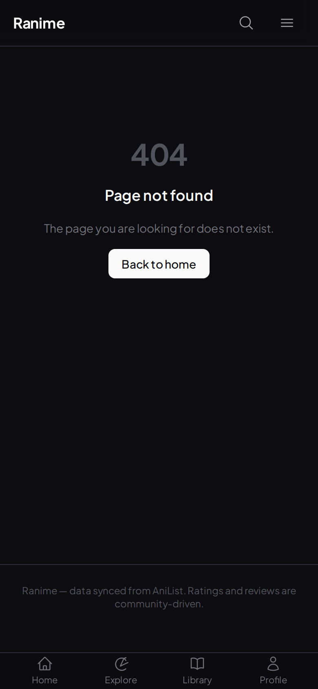

# Ranime

<p align="center">
  &nbsp;
  &nbsp;
  &nbsp;
  &nbsp;
  &nbsp;
  &nbsp;
  &nbsp;
  
</p>

<p align="center">
  <strong>Fast, self-hosted, local-first anime discovery and personal tracker.</strong><br />
  Pulls catalog data from AniList via GraphQL, caches locally in PostgreSQL, and serves a snappy ad-free UI.
</p>

<p align="center">
  
  
  
  
  
</p>

---

## Why this exists

I wanted an anime tracking tool that doesn't bombard you with banner ads, slow bloated pages, or aggressive third-party rate limits. 

Ranime runs locally on your machine (or on your private VPS). It syncs anime metadata from AniList on-demand, stores it in your own PostgreSQL instance, and lets you manage your watch history, create custom tier lists, spin discovery wheels, and compare anime without friction.

---

## Feature Tour

### 1. Home & Trending
Seasonal spotlights, your continue-watching shelf, and latest community reviews.



---

### 2. Airing Calendar (`/airing`)
Weekly broadcast schedule organized by day of the week with real-time episode countdowns.



---

### 3. Interactive Tier List Maker (`/tier-list`)
Rank and customize anime into S, A, B, C, D tiers. Supports drag/slotting and exports the final board directly as an image.


---

### 4. Recommendation Roulette (`/roulette`)
Spin to discover anime when you're stuck on what to watch next. Filter by genre, format (TV/Movie), and minimum community score.



---

### 5. Side-by-Side Comparison Matrix (`/compare`)
Compare two or three anime side by side: score breakdown, broadcast format, episode duration, studio, and shared genres.



---

### 6. Catalog Explorer (`/explore`)
Search and filter across genres, format, season, year, and production studio with instant local caching.



---

### 7. Franchise Relations & Character Roles (`/anime/:id`)
Comprehensive show details: chronological franchise relation tree, staff credits, voice actor language breakdown, and reviews.



---

### 8. Personal Library & Batch Actions (`/library`)
Toggle between table and poster grid views, bump episodes with one-click `+1 Ep`, or use multi-select bulk editing.



---

### 9. Stats & Anime Passport (`/stats`)
Visual infographic breakdown of completed anime, hours spent, genre distribution, and a shareable anime passport.



---

### 10. Mobile-First Navigation
Optimized for smartphones with bottom tab bars, safe-area insets, and universal Command Palette (`Ctrl+K` / `Cmd+K`).

<p align="center">
  
</p>

---

## Tech Stack Overview

| Area | Technologies |
|---|---|
| **Frontend** | React 19, TypeScript, Vite, React Router 7, TanStack Query v5, Tailwind CSS v4, Lucide Icons |
| **Backend API** | Fastify 5, TypeScript, Drizzle ORM, Zod, Argon2id, Jose (JWT) |
| **Database** | PostgreSQL 16 (Docker) |
| **External API** | AniList GraphQL (On-demand caching) |
| **Testing** | Vitest |

---

## Quickstart

### Prerequisites
- Node.js 20+
- Docker & Docker Compose

### 1. Clone & install dependencies
```bash
git clone https://github.com/h1ntz0/Ranime.git
cd Ranime
npm install
```

### 2. Environment configuration
```bash
cp .env.example .env
```
*(Pre-configured out of the box for the local Docker PostgreSQL database)*

### 3. Start database & seed
```bash
npm run db:up
npm run db:migrate
npm run db:seed
```
*Default demo account credentials:*  
Email: `demo@example.local` | Password: `password123`

### 4. Start development servers
```bash
npm run dev
```
- Frontend: `http://localhost:3000`
- Backend API: `http://localhost:4000/api`

---

## Available Commands

| Command | Purpose |
|---|---|
| `npm run dev` | Start both Vite and Fastify servers concurrently |
| `npm run build` | Build frontend and backend for production |
| `npm run typecheck` | Run TypeScript validation across all workspaces |
| `npm run test` | Run test suite with Vitest |
| `npm run db:up` | Spin up PostgreSQL container |
| `npm run db:migrate` | Apply database migrations |
| `npm run db:seed` | Seed initial demo data |

---

## License
MIT. Free to self-host and customize.
